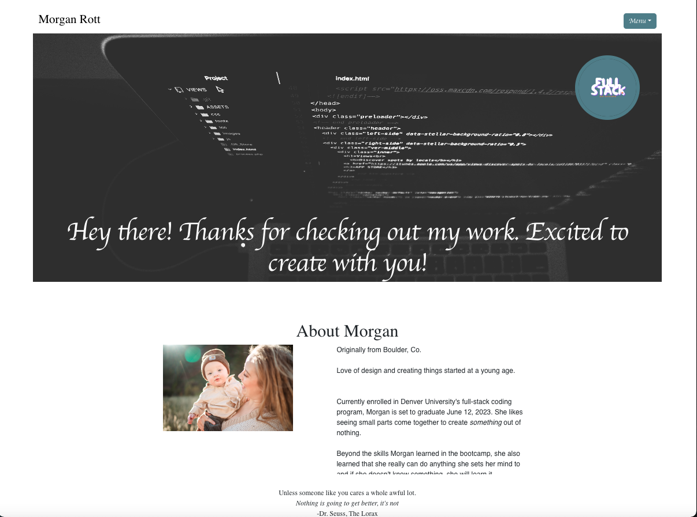

# Morgan's Portfolio

## Description

This is a portfolio website that showcases my work as a web developer and is built with React. It contains an About Me section, a Portfolio section, a Contact section and a Resume section. 

Thanks for looking at my work!

## Table of Contents

* [Installation](#installation)
* [Usage](#usage)
* [License](#license)
* [Screenshot](#screenshot)
* [Link to deployed application](#link-to-deployed-application)

## Installation

To install this application, clone the code into your terminal. Install the dependencies by running `npm install` in your terminal. Then run `npm start` to start the application.

## Usage

This app is used to create my portfolio.

## License

## Screenshot

## Link to deployed application

https://mrott0397.github.io/portfolio/